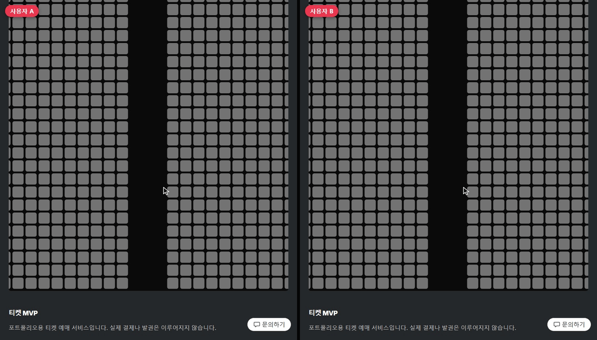
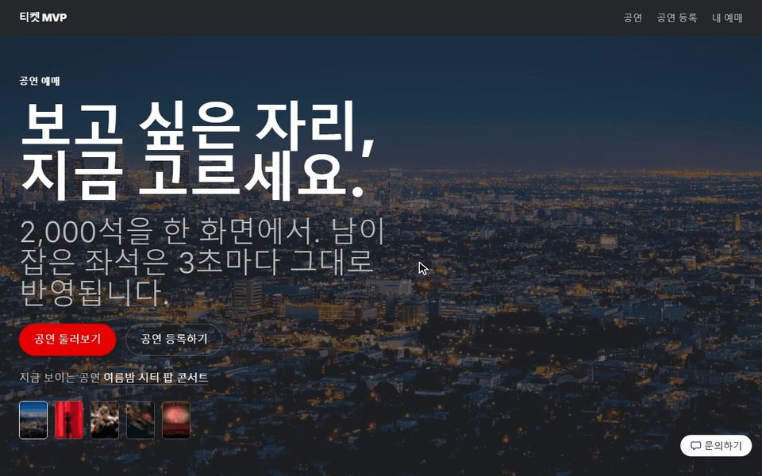
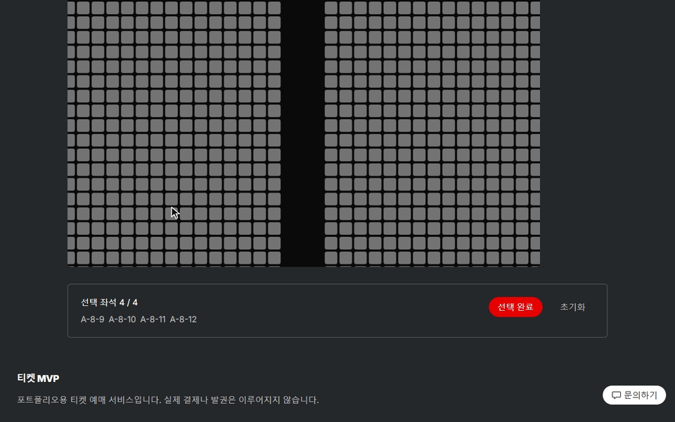
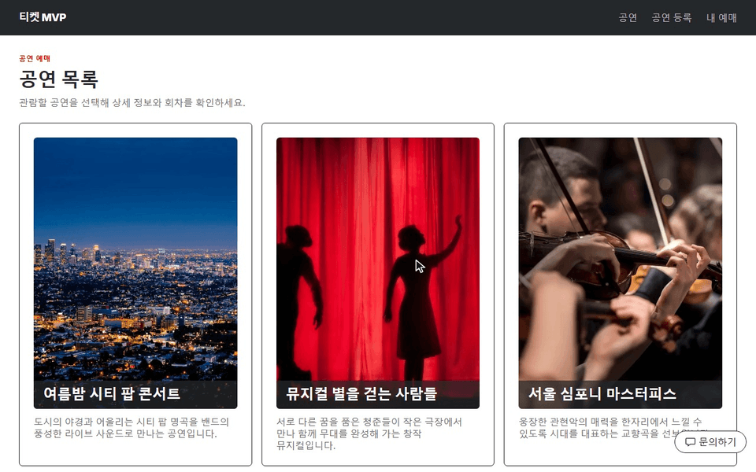
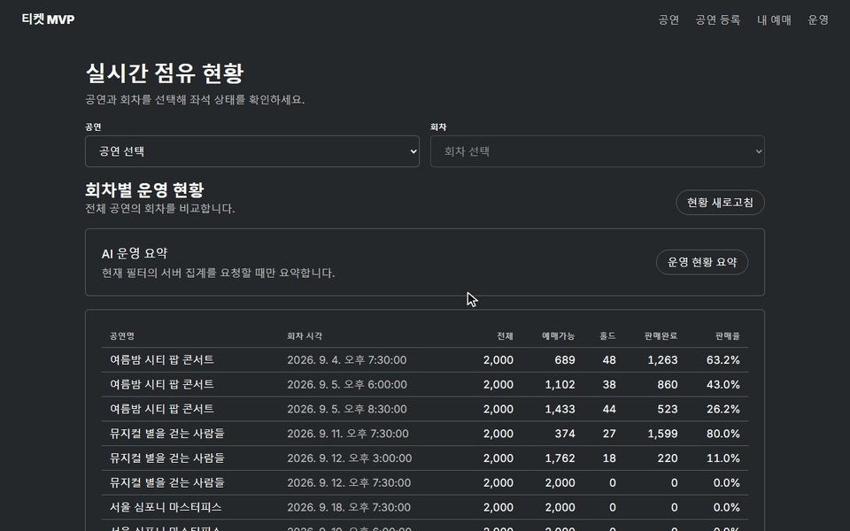
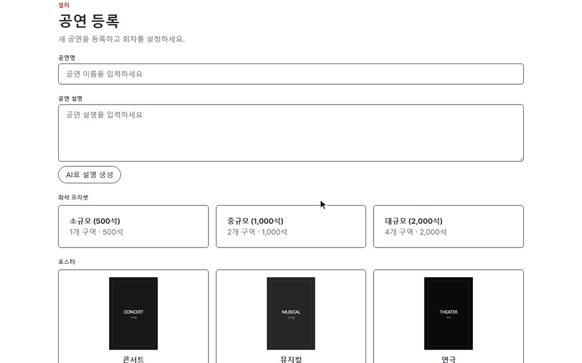

# 데모 GIF

로컬 dev 서버(인메모리 저장소)에서 Playwright로 녹화했고, 재생 속도는 실제의 1.4~2배입니다. 커서와 `사용자 A`/`사용자 B` 표시는 녹화용 오버레이입니다.

배포본에서 직접 확인하려면 [심사자용 3분 투어](REVIEWER_TOUR.md)를 따라가세요.

## 좌석 경합 — 두 사용자가 같은 좌석을 노릴 때

쿠키가 분리된 두 브라우저입니다. A가 먼저 잡은 좌석은 B 화면에서 폴링으로 회색이 되고, 같은 좌석을 뒤늦게 요청한 B는 409 토스트와 함께 요청 전체가 거절됩니다. A는 그대로 예매를 확정합니다.

## 예매 여정 — 목록에서 좌석 4석까지

공연 목록 → 상세 → 회차 → 2,000석 SVG. 휠 줌·드래그 팬·`전체 보기` 뒤 4석을 고르면 5번째 좌석은 선택되지 않습니다.

## 예매 확정과 취소

`선택 완료`로 서버 hold를 잡고 `예매 확정`한 뒤, `내 예매`에서 취소하면 상태가 `취소됨`으로 바뀝니다.

## 문의 챗봇

추천 질문과 직접 입력한 질문에 공연·회차 잔여석 조회 툴 결과로 답합니다. 녹화 환경에는 Slack 자격 증명을 넣지 않아 상담원 연결 버튼이 보이지 않습니다.

## Admin 운영 현황

회차별 운영 표와 `운영 현황 요약`(AI 스트리밍)을 본 뒤 회차를 고르면 점유 카드와 읽기 전용 좌석맵이 붙습니다. 판매·홀드 좌석은 녹화 직전에 API로 채웠습니다.

## 셀러 공연 등록 + AI 설명

공연명을 넣고 `AI로 설명 생성`을 누르면 설명이 스트리밍으로 채워지고, `이 설명 사용`으로 설명 칸에 옮깁니다.
